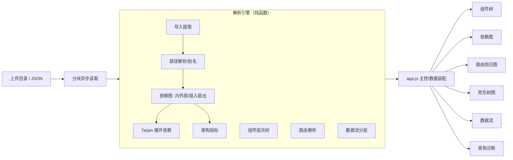

# 面向大型 Web 前端项目的层次化可视化与架构诊断系统

> 科研训练项目论文（草稿）· Markdown 版
> 作者：________　指导教师：________　日期：2026 年 5 月

---

## 摘要

随着前端工程规模的持续膨胀，单个 Web 应用动辄包含成百上千个组件、模块与路由，其组件依赖、路由组织与数据流向交织成复杂的隐式结构，给开发者的架构理解、问题定位与重构规划带来显著困难。现有工具（如 Madge、dependency-cruiser、webpack-bundle-analyzer）多聚焦于**单一维度**且常以平面图或命令行报告呈现，缺乏统一的、层次化的、面向交互的可视化视角，也较少提供"开箱即用"的浏览器内体验。

本文设计并实现了一套**纯前端、零构建**的层次化可视化与架构诊断系统。系统以一个与 DOM 解耦的**静态解析引擎**为核心，从上传的前端代码库中解析出依赖关系、组件渲染层次、路由层级与数据流向，并基于 Tarjan 强连通分量算法**自动检测循环依赖**、计算扇入/扇出、孤儿模块等架构指标；前端以 D3.js 提供六种层次化视图（组件层次树、依赖关系图、路由旭日图、模块矩形树图、数据流向图、架构诊断概览）与统一的搜索、详情、缩放、导出交互。系统对解析引擎施加严格的单元/集成测试，并在合成项目上完成性能基准：在普通笔记本（Node.js v24）上解析 4000 个源文件、约 1.7 万条依赖、80 处循环依赖的全流程耗时约 **129 ms**，呈近似线性的可扩展性。案例研究表明，系统能在电商示例项目中正确识别出耦合枢纽（`ApiService`）、路由分发中心（`Router`）与孤儿模块（`Toast`、`UIStore`），验证了其辅助开发者快速定位架构问题的有效性。

**关键词**：前端架构可视化；依赖分析；循环依赖检测；层次化可视化；D3.js；静态分析

---

## 1　引言

### 1.1　研究背景
现代 Web 前端以组件化框架（React、Vue、Angular 等）为主流，配合模块打包、路由管理与集中式状态管理，形成了层次丰富但**高度隐式**的内部结构。这种结构散落在成百上千个源文件的 `import`/`export`、JSX/模板、路由配置与状态订阅之中，难以从代码文本直接把握。当项目规模增大、人员更替频繁时，"这个组件被谁用、这个模块依赖什么、改它会牵动哪里、有没有循环依赖"等问题的回答成本急剧上升。

### 1.2　问题与动机
开发者、设计师与新加入的维护者都需要一种能够**层次化、可交互地观察前端架构**的手段。然而：
1. 通用图可视化工具（如 Graphviz）需要使用者自行抽取数据、不理解前端语义；
2. 专用工具大多**维度单一**：Madge 主打依赖与循环检测、bundle-analyzer 主打产物体积、CodeSee 偏重协作但偏商业化与重型；
3. 多数工具以静态图片、命令行报告或需安装的服务呈现，**缺乏统一、轻量、即开即用**的层次化交互界面。

### 1.3　研究目标
面向 Web 前端界面，构建一套可层次化的可视化系统，实现数据、组件与界面结构的分层展示与交互，帮助开发者、设计师与用户更清晰直观地理解复杂前端架构，提升界面开发、调试与优化效率。具体聚焦于**前端项目结构可视化**：将组件依赖、路由关系、数据流向等以层次化图形呈现，并辅以自动诊断，便于快速定位问题与规划架构。

### 1.4　主要贡献
- **统一的层次化可视化平台**：在一个零构建的浏览器应用中集成六种互补视图，覆盖组件、依赖、路由、体积、数据流与诊断六个维度。
- **语义感知的前端静态解析引擎**：支持相对路径、`index` 解析、`@/` 与 tsconfig/jsconfig 路径别名、内部模块/外部 npm 依赖区分，以**完整路径**而非文件名标识节点，消除同名合并误差。
- **面向"定位问题"的架构诊断**：基于 Tarjan 算法的循环依赖检测，结合扇入/扇出、孤儿模块、耦合热点等指标，将"可视化"升级为"可诊断"。
- **工程化与可复现评估**：解析引擎与渲染层解耦、纯函数化、可在 Node 下测试；提供单元/集成测试与可复现的性能基准脚本。

---

## 2　相关工作

### 2.1　前端依赖与产物分析工具
- **Madge**：基于 AST 解析模块依赖、可输出依赖图与循环依赖列表，偏命令行/静态 SVG。
- **dependency-cruiser**：以规则校验依赖（如禁止跨层依赖、检测循环），可生成报告，配置较重。
- **webpack-bundle-analyzer / source-map-explorer**：聚焦**打包产物体积**，以矩形树图展示，但不揭示组件/路由/数据流结构。
- **CodeSee 等商业平台**：提供代码地图与协作，但偏重型、闭源、依赖云服务。

### 2.2　层次结构可视化技术
层次数据的经典可视化范式为本系统所借鉴：Reingold–Tilford 整洁树布局用于组件层次树；Shneiderman 提出的矩形树图（Treemap）用于体积占用；旭日图（Sunburst，Stasko 等）以径向分区展示路由层级；力导向布局用于依赖网络。D3.js（Bostock 等）提供了上述布局的统一数据驱动实现。

### 2.3　对比与定位
| 能力 | Madge | dependency-cruiser | bundle-analyzer | **本系统** |
|---|---|---|---|---|
| 组件依赖图 | ✅ | ✅ | ✗ | ✅ |
| 循环依赖检测 | ✅ | ✅ | ✗ | ✅ |
| 组件渲染层次 | ✗ | ✗ | ✗ | ✅（启发式） |
| 路由层级 | ✗ | ✗ | ✗ | ✅ |
| 模块体积 | ✗ | ✗ | ✅ | ✅ |
| 数据流向 | ✗ | ✗ | ✗ | ✅（推导） |
| 架构指标诊断 | 部分 | 部分 | ✗ | ✅ |
| 零安装/浏览器内 | ✗ | ✗ | 部分 | ✅ |
| 统一交互界面 | ✗ | ✗ | 部分 | ✅ |

本系统的差异化在于：以**统一的层次化交互界面**整合多维度，并将分析下沉为**浏览器内零构建**的体验，强调"理解 + 诊断"的闭环。

---

## 3　系统设计与总体架构

### 3.1　设计原则
1. **引擎与渲染解耦**：所有分析逻辑集中于纯函数引擎 `analyzer.js`，与 DOM、D3 无关，可独立测试与复用。
2. **零构建、零后端**：仅依赖本地 D3.js，双击 `index.html` 运行，便于教学、演示与离线使用，数据不出本地。
3. **可插拔视图**：每个视图为独立类，遵循统一 `search()/destroy()` 生命周期，主控按需实例化。

### 3.2　总体架构



数据流水线为：**读取 → 解析建模 → 装配 → 渲染**。主控 `app.js` 持有 `activeData`，按视图惰性派生循环依赖与指标，并把"视图就绪"的对象交给对应视图类。

### 3.3　统一数据模型
- **树（TreeNode）**：`{name, category, size?, children?}`，服务组件树与矩形树图。
- **图（Graph）**：`{nodes:[{id, label, category, internal, fanIn, fanOut, size}], links:[{source,target}]}`，节点以**完整路径**为 `id`。
- **路由（RouteNode）**：`{name, path, component, category, children?}`。
- **数据流（FlowGraph）**：`{nodes:[{id,label,category,layer}], links:[{source,target,value}], layerLabels}`。

`category` 取自统一调色板（page/layout/component/common/store/util/hook/service/action/style/asset/route/external），是跨视图一致着色的语义锚点。

---

## 4　静态解析方法

本节描述引擎如何从源码文本恢复出上述模型，是系统的方法学核心。

### 4.1　导入提取
对去除注释后的源码，以正则覆盖四类模块引用：`import … from '…'`、副作用 `import '…'`、动态 `import('…')`、`require('…')`，得到模块说明符集合。为支持组件层次解析，另行提取每条导入的**绑定标识符**（默认/命名/命名空间），用于后续 JSX 用法匹配。

### 4.2　路径解析与别名
说明符解析为三类结果：内部文件、外部 npm 包、或未解析。算法：
1. 以 `.` 开头者按导入文件所在目录做相对路径规整（处理 `./`、`../`）；
2. 命中别名前缀（`@/` 及从 `tsconfig/jsconfig` 的 `compilerOptions.paths` 自动提取的别名）者按别名目标改写；
3. 其余裸说明符判为**外部依赖**，包名按 `@scope/pkg` 或首段归一；
4. 对候选路径在全量文件集合中尝试补全扩展名（`.js/.jsx/.ts/.tsx/.vue/…`）与 `index.*`，命中即为内部文件。

该设计修复了"以文件名（basename）做标识导致同名文件被错误合并、且无法区分内部模块与第三方库"的常见缺陷。

### 4.3　依赖图构建
遍历源文件，为其建立内部节点（类别由路径/命名启发式 `guessCategory` 推断），对每条已解析导入建立有向边并去重，同时累计源节点扇出、目标节点扇入；外部依赖以 `npm:<pkg>` 标识、`internal=false`。节点显示尺寸取度数 `max(3, fanIn+fanOut)`。

### 4.4　循环依赖检测（Tarjan SCC）
采用**迭代式** Tarjan 强连通分量算法（以显式栈替代递归，避免大型图的调用栈溢出），输出规模大于 1 的强连通分量为循环依赖，并单独识别自环。核心思想：

```
对每个未访问结点 v 启动 DFS：
  分配 index/low 并入栈；
  对每条出边 (v,w)：
    w 未访问 → 递归，回溯后 low[v]=min(low[v],low[w])；
    w 在栈中 → low[v]=min(low[v],index[w]);
  若 low[v]==index[v]：弹栈直至 v，所得集合为一个 SCC。
```

复杂度 O(V+E)。这是系统将"可视化"提升为"问题定位"的关键能力——循环依赖会在依赖图中以红色高亮、并在诊断概览中以依赖链形式列出。

### 4.5　架构指标
在依赖图上计算：内部模块数、外部依赖数、连线数、**孤儿模块**（扇入扇出皆为 0）、**最被依赖模块**（扇入 Top-k，耦合枢纽）、**高耦合模块**（扇出 Top-k）、循环依赖数与涉及结点数。对缺失度数的外部图（示例/JSON 上传）提供幂等的度数补齐，保证指标普适。

### 4.6　组件层次树（启发式）
组件渲染关系本质是有向图（含复用与递归），并非严格的树。系统据"导入解析到组件文件 ∧（其绑定在 JSX/模板中作为标签出现 ∨ 为默认导入）"判定父子用法，并以**首次展开、重复引用标记为引用**的策略将其规约为可读的树：以 `App`/`main`/`index` 或入度最小者为根，沿用法关系展开，遇祖先即截断以防环。无组件证据时回退至文件树。

### 4.7　路由解析
两条路径互补：① 扫描 `<Route path=… component/element=…>` 配置，达到一定数量则据此建树；② 否则按文件路由约定（`pages|views|app|routes|screens` 目录）建树，并将 `index`→`/`、`[id]`→`:id`、`[...x]`→`*` 等动态段归一。

### 4.8　数据流分层
将内部模块按架构角色映射到五层：服务/数据源 → 状态管理 → Hooks/Selectors → 页面 → 组件。把"A import B"理解为"数据由 B 流向 A"，仅保留跨层边形成左→右流向；每层按度数取 Top-12 以保证大型项目的可读性（并标记是否截断）。该方法以真实依赖为依据，取代了早期"无论上传何项目都显示固定示例"的占位实现。

### 4.9　复杂度小结
设文件数 F、平均每文件导入数 L、图结点 V≈F、边数 E≈F·L。导入提取 O(F·L̄)（L̄ 为源码长度）、路径解析借助哈希集合与有界扩展名探测近似 O(1)/次、依赖图 O(V+E)、Tarjan O(V+E)、指标排序 O(V log k)。整体近似线性，与第 7 节实测曲线一致。

---

## 5　可视化与交互设计

### 5.1　六视图与布局算法
- **组件层次树**：D3 整洁树（`d3.tree`），可折叠、深度滑块控制可见层级，曲线连接 + 过渡动画。
- **依赖关系图**：力导向（`forceSimulation`，含连接/电荷/中心/碰撞力），节点可拖拽、悬停高亮邻接子图，循环依赖红色高亮、外部依赖虚线描边。
- **路由旭日图**：径向分区（`d3.partition`），悬停高亮祖先路径，中心显示路由总数。
- **模块矩形树图**：`d3.treemap`，按文件大小排布、点击下钻 + 面包屑返回。
- **数据流向图**：自定义分层坐标布局，链路上有动画粒子表征"流动"。
- **架构诊断概览**：指标卡片 + 循环依赖链 + 孤儿模块清单 + 扇入/扇出 Top 榜（条形可视化）。

### 5.2　通用交互
全局搜索（防抖、命中高亮其余淡出）、悬停 Tooltip 与右侧详情面板、缩放/平移、全屏、**颜色图例**、**导出当前视图为 SVG**（用于论文/文档配图）、上传进度反馈与空状态提示。

### 5.3　面向大规模的优化
分块异步读取源文件（无文件数量上限）；依赖图在结点超阈值时**稀释标签**（仅高连接度结点显示文字）；提供"隐藏外部依赖"开关以降噪；数据流每层 Top-N 截断并提示。安全方面，详情/提示对用户数据统一 HTML 转义，规避注入。

---

## 6　实现

- **技术栈**：原生 HTML/CSS/ES6 Class + D3.js v7，无打包器、无运行时三方依赖、无后端。
- **双模式引擎**：`analyzer.js` 在浏览器挂载为全局 `Analyzer`，在 Node 下 `module.exports`，从而既服务页面又可被测试 `require`。
- **模块组织**：`analyzer.js`（引擎）/`app.js`（主控）/`utils.js`（配色·提示·详情·转义）/`data.js`（示例）/ 六个视图类 / `overview.js`（诊断）。
- **可复现脚手架**：`package.json` 提供 `npm test`（聚合测试）与 `npm run serve`（零依赖静态服务器）。

---

## 7　评估

### 7.1　正确性（测试）
解析引擎以 Node 原生 `assert` 编写测试，全部通过：
- **单元测试**（`analyzer.test.js`，9 组）：相对/别名/外部路径解析、按路径标识与内外部区分、Tarjan 循环检测、孤儿与最被依赖、组件层次树根与渲染子节点、路由推导、数据流分层与"同层不连线"、缺度数自动补齐。
- **集成测试**（`integration.test.js`）：`analyzeProject()` 在含别名、外部依赖、循环、孤儿、Vue 文件与 `pages` 路由的合成项目上，产出的对象形状恰为各视图所消费的结构。
- **回归测试**（`component-tree-depth.test.js`）：组件树深度折叠逻辑。

### 7.2　性能与可扩展性
以 `tests/bench.js` 生成不同规模的合成项目（含分层依赖与周期性循环依赖），测量 `analyzeProject()` 全流程耗时（Node.js v24，普通笔记本）：

| 规模(文件) | 解析总耗时(ms) | 依赖结点 | 依赖连线 | 检出循环 |
|---:|---:|---:|---:|---:|
| 200 | ~16 | 202 | 833 | 4 |
| 500 | ~18 | 502 | 2 145 | 10 |
| 1 000 | ~30 | 1 002 | 4 332 | 20 |
| 2 000 | ~64 | 2 002 | 8 705 | 40 |
| 4 000 | ~129 | 4 002 | 17 452 | 80 |

耗时随规模近似**线性**增长，4000 文件、约 1.7 万条边、80 处循环依赖的完整解析（含 Tarjan 与指标）约 129 ms，证实引擎可支撑大型项目的交互式分析（结果可由 `node tests/bench.js` 复现）。

### 7.3　案例研究：电商示例项目
对内置电商示例（31 个依赖结点、45 条边）运行诊断，系统给出与人工直觉一致的结论：
- **耦合枢纽**：`ApiService` 扇入最高（7），符合"所有 Store 均经其访问后端"的设计；
- **分发中心**：`Router` 扇出最高（6），对应其向各页面的路由分发；
- **孤儿模块**：识别出 `Toast`、`UIStore` 两个未被引用的模块（提示潜在死代码或接线缺失）；
- **健康度**：循环依赖数为 0，表明该示例为无环架构。

上述结果表明，系统能够把"读代码才能得到的架构判断"转化为**一眼可见的指标与高亮**，切实服务于"快速定位问题"的目标。

### 7.4　与现有工具的对比讨论
相较 Madge/dependency-cruiser 的单维度命令行式分析，本系统在**维度广度**（六视图）、**交互性**与**零安装体验**上更优；相较 bundle-analyzer 的纯体积视角，本系统补足了组件、路由、数据流与诊断。其代价是：受限于纯前端与正则启发式，**解析精度**弱于基于完整编译器/AST 的工具（见第 8 节）。

---

## 8　局限与展望

1. **解析精度**：当前以正则 + 启发式为主，对运行时拼接的导入路径、复杂自定义 `resolve` 别名、宏/代码生成产物覆盖有限。**展望**：引入轻量 AST（如 `@babel/parser`、`@vue/compiler-sfc`）以获得更精确的依赖与组件用法、props/状态订阅。
2. **组件层次的图–树规约**：复用与递归被规约为"引用"标记，可能弱化部分结构。**展望**：提供 DAG 视图与"展开全部出现"选项。
3. **路由解析**：尚不能完全理解集中式路由配置中的动态与懒加载组合。**展望**：针对 React Router/Vue Router/Next/Nuxt 各自的约定做专门解析器。
4. **数据流为角色分层近似**：非真正的运行时数据流追踪。**展望**：识别具体状态管理范式（Redux/Pinia/Zustand/Context）的 action–reducer–selector 链路。
5. **评估深度**：已具备正确性与性能评估，尚缺**真实开源项目的规模化实测**与**面向开发者的可用性用户研究**。**展望**：在多个真实仓库上做案例与计时，并以问卷/任务完成时间评估理解效率提升。
6. **工程能力**：可增加增量解析、版本间架构 Diff、PNG 导出、可访问性（键盘导航/ARIA）与 IDE 插件集成。

---

## 9　结论

本文针对大型 Web 前端项目结构难以直观理解的问题，设计并实现了一套零构建、浏览器内运行的层次化可视化与架构诊断系统。其以解耦的纯函数解析引擎为核心，语义化地恢复依赖、组件、路由与数据流结构，并以 Tarjan 算法与多项指标实现自动诊断；前端以六种 D3 视图与统一交互呈现，将"理解—定位—规划"连成闭环。测试、性能基准与案例研究共同表明：系统正确、近似线性可扩展，并能在示例项目中有效揭示耦合枢纽、孤儿模块与环依赖。后续将在解析精度（AST）、真实项目实测与用户研究等方向继续完善，以更好支撑前端架构的开发、调试与优化。

---

## 参考文献

1. Tarjan, R. E. *Depth-First Search and Linear Graph Algorithms.* SIAM Journal on Computing, 1(2), 1972.
2. Bostock, M., Ogievetsky, V., Heer, J. *D³: Data-Driven Documents.* IEEE Transactions on Visualization and Computer Graphics, 17(12), 2011.
3. Reingold, E. M., Tilford, J. S. *Tidier Drawings of Trees.* IEEE Transactions on Software Engineering, SE-7(2), 1981.
4. Shneiderman, B. *Tree Visualization with Tree-Maps: A 2-D Space-Filling Approach.* ACM Transactions on Graphics, 11(1), 1992.
5. Stasko, J., Zhang, E. *Focus+Context Display and Navigation Techniques for Enhancing Radial, Space-Filling Hierarchy Visualizations (Sunburst).* IEEE InfoVis, 2000.
6. Madge — A tool for generating a visual graph of module dependencies. https://github.com/pahen/madge
7. dependency-cruiser — Validate and visualize dependencies. https://github.com/sverweij/dependency-cruiser
8. webpack-bundle-analyzer. https://github.com/webpack-contrib/webpack-bundle-analyzer
9. source-map-explorer. https://github.com/danvk/source-map-explorer
10. D3.js Documentation. https://d3js.org/
11. React Documentation. https://react.dev/　Vue.js Documentation. https://vuejs.org/

---

> 附：系统源码、可复现测试（`npm test`）与性能基准（`node tests/bench.js`）随论文一并交付；图表可经各视图右上角"导出 SVG"按钮获取，用于正式排版配图。
